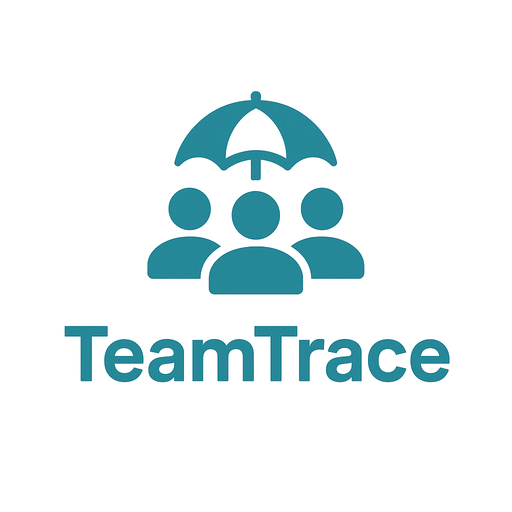

    
    
A small tool to monitor our team capacity.

## GUI
The GUI is built using HTML, CSS, and JavaScript. The layout is simple and clean, but at the moment only in German.

## Build
To build the application, open a comandline, navigate to the repo root folder an start the **build.bat**.

## Third party tools
Find under **static/assets**
- jQuery 3.7.1 - https://jquery.com/
- jQuery UI 1.14.1 - https://jqueryui.com/
- jQuery tablesorter 2.32.0 - https://github.com/Mottie/tablesorter
- jQuery multi-select 0.9.12 - https://github.com/lou/multi-select
- bootstrap 5.3.7 - https://getbootstrap.com/
- Chart.js 4.5.0 - https://www.chartjs.org/

## License
TeamTrace is available under the [GPL License](LICENSE)
